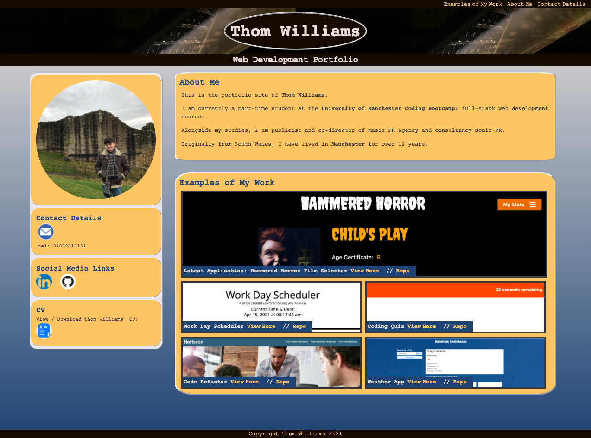
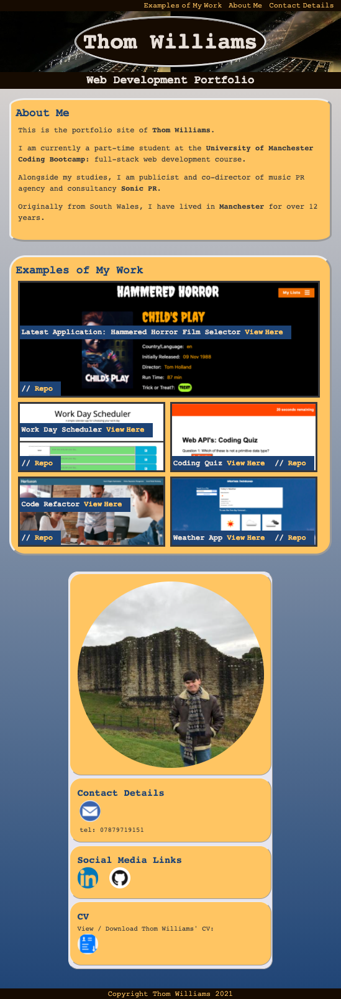

# updated-portfolio-tew

Thom Williams Web Developer Portfolio

Updated Web development portfolio for Thom Williams. It is designed to showcase his portfolio of websites and applications designed over the course of the University of Manchetser Coding Bootcamp course. 

It contains contact information, a profile image, a brief biography and a showcase of his web development projects.

## Installing / Getting started

Hosted by Github Pages. The application loads in the web browser. All files available to clone / download from Thom Willims' GitHub repo. 

### Initial Configuration

N/A Application should load in any universal browser.

## Developing

To clone this template, or develop further from this repo, please head to GitHub and follow these steps:

```shell
git clone https://github.com/ThomWilliams/updated-portfolio-tew
cd updated-portfolio-tew
code .
```

The repository comprises a HTML index file, CSS style file, CSS reset file, associated images and this README.

### Building

No further additional steps should be required for the developer to view the files / build on the project.

Once opened in any browser such as Chrome, the styled html page for Thom Williams Web Development portfolio should be displayed. 

### Deploying / Publishing

All developments by Thom Williams to the main branch. Deployed on Git Hub pages to the following address: 

[Github Pages](https://thomwilliams.github.io/updated-portfolio-tew/)


## Features

This website is intended as a professional portfolio to display the web development projects of Thom Williams. It features a semantically structure HTML document and is styled with a CSS style sheet. A CSS reset is also provided. 

Key features include:

* There is a navigation bar with internal links to its main sections situated at the top of the page. Pseudocode is used to highlight links in blue when hovered over. 
* There is a custom designed logo and hero banner images.
* Thom's website portfolio is illustated in the "Examples of My Work", with the most recent project illustrated with a larger flex box at the top. Pseudocode functions enlarge and highlights each projects when hovered over. Thom's first project is currently linked, with placeholder images holding the positions for future projects.
* A "Contact-Sidebar" aside offers useful contact information and a profile image of Thom Willimas.
* The profile image enlarges when clicked.
* The About Me column offers a short introduction to Thom Willimas.
* CSS Variables have been used to defined a consistent colour scheme throughout. The colour scheme chosen passes accessibility contrast standards.
* Media queries have been used to provide a responsive layout suited for desktop and mobile use. The mobile version renders the site into a single column layout.
* Icons to access Thom's GitHub profile, LinkedIn, Email and CV also feature.
* Screenshots and links to Web Development projects and appropriate GitHub repos are provided.

## Links

- Project homepage: [GitHub](https://thomwilliams.github.io/updated-portfolio-tew/)
- Repository: [GitHub](https://github.com/ThomWilliams/updated-portfolio-tew)
- Issue tracker: [GitHub](https://github.com/ThomWilliams/updated-portfolio-tew/issues)
  - In case of sensitive bugs like security vulnerabilities, please contact thomwilliams1990@gmail.com. We value your effort to improve the security and privacy of this project.
- Related projects: [GitHub](https://github.com/ThomWilliams)


## Accessibility

Steps to meet accessibility standards include:

* Semantic HTML structure.
* Suitable contrasting colour scheme.


# Screenshot

A screenshot of both the desktop and mobile versions have been provided Available in assets Folder: 

Mobile version: 

Desktop version: 


======
## Credits

These are the web articles referenced during this Code Refactor accessibility excercise. 

[w3 Schools](https://www.w3schools.com/)
[wave](https://wave.webaim.org/)
[css tricks](https://css-tricks.com/)
[Mozilla Developer](https://developer.mozilla.org/en-US/docs/Learn/Accessibility/HTML)
[GitHub Readme Guide](https://github.com/jehna/readme-best-practices)
[Freecodecamp Responsive image guide](https://www.freecodecamp.org/news/css-responsive-image-tutorial/)

## License

MIT License

Copyright (c) [2021] [Thomas Edward Williams]

Permission is hereby granted, free of charge, to any person obtaining a copy
of this software and associated documentation files (the "Software"), to deal
in the Software without restriction, including without limitation the rights
to use, copy, modify, merge, publish, distribute, sublicense, and/or sell
copies of the Software, and to permit persons to whom the Software is
furnished to do so, subject to the following conditions:

The above copyright notice and this permission notice shall be included in all
copies or substantial portions of the Software.

THE SOFTWARE IS PROVIDED "AS IS", WITHOUT WARRANTY OF ANY KIND, EXPRESS OR
IMPLIED, INCLUDING BUT NOT LIMITED TO THE WARRANTIES OF MERCHANTABILITY,
FITNESS FOR A PARTICULAR PURPOSE AND NONINFRINGEMENT. IN NO EVENT SHALL THE
AUTHORS OR COPYRIGHT HOLDERS BE LIABLE FOR ANY CLAIM, DAMAGES OR OTHER
LIABILITY, WHETHER IN AN ACTION OF CONTRACT, TORT OR OTHERWISE, ARISING FROM,
OUT OF OR IN CONNECTION WITH THE SOFTWARE OR THE USE OR OTHER DEALINGS IN THE
SOFTWARE.